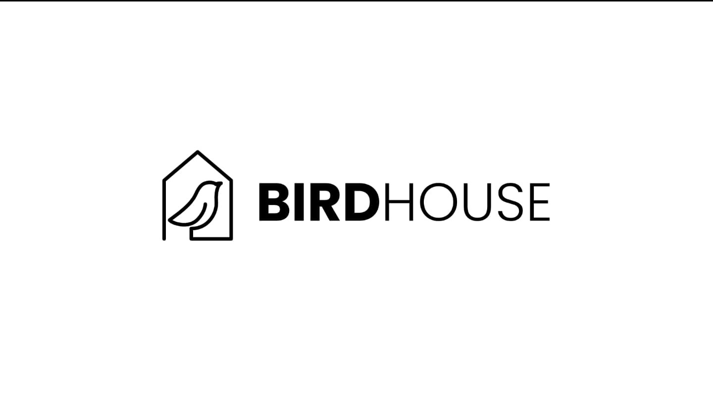

# Birdhouse

<!--  -->
<!--  -->

This repository hosts the code for Birdhouse, a decentralized Federated Learning web app using Flock.io’s design principles, focusing on accessible and secure machine learning training across distributed nodes, built as part of the Encode London Hackathon hosted October 25 to October 27, 2024. The application is built with a **backend** for managing federated learning processes and a **frontend** for an intuitive user experience.

## Table of Contents
- [Project Structure](#project-structure)
- [Built With](#built-with)
- [Features](#features)
- [Flock.io Principles](#flock.io-principles)
- [Getting Started](#getting-started)
  - [Prerequisites](#prerequisites)
  - [Installation](#installation)
  - [Usage](#usage)
- [License](#license)


## Project Structure

 * /backend
   * client.py
   *  data_preprocessing.py
   * device_manager.py
   * flock_model.py
   * flock_trainer.py
   * flnn_flock_model.py
   * model_classes.py
   * mongo_url.txt
   * node.py
 * /frontend
   * public/
   * src/
      * assets/
      * components/
      * contexts/
      * images/
      * layouts/
      * theme/
      * variables/
      * views/
      * App.js
      * index.js
      * routes.js
  * LICENSE.txt
  * README.md
## Built With

* [![Flask][Flask.com]][Flask-url]
* [![React][React.js]][React-url]
* [![Redux][Redux.js]][Redux-url]
* [![Express][Express.js]][Express-url]
* [![PyTorch][Torch]][Torch-url]
* [![Transformers][Transformers]][Transformers-url]
* [![Scikit-Learn][Scikit-Learn.com]][Scikit-Learn-url]

## Features

- **Federated Learning Model**: Decentralized model training using nodes across the network.
- **Decentralized Incentivization**: Proof-of-stake and reward systems with token staking.
- **User Roles**: Support for task creators/delegators and training/validation nodes.
- **Comprehensive UI**: Frontend for model setup, training node management, and performance tracking.
- **Attack Mitigation**: Security features against Sybil, DoS, Free-rider, and Lookup attacks.
<!-- - **Temporary cURL Command Support**: While the model creation UI is under development, we support cURL-based model setup.
- **Future Proof**: Plans for AI Marketplace and FL alliance with upcoming model creation UI and validation nodes UI. 
-->
## Flock.io Principles

## Getting Started

### Prerequisites

- **Node.js 20.18.0**: (For the frontend)
- **Python 3.12.2**: (For the backend)

### Installation

1. Clone the repository on each client and navigate to the backend folder:
   ```bash
   git clone https://github.com/Aquila69420/birdhouse.git
   ```
2. Install the dependencies:
   ```bash
   pip install -r requirements.txt
   ```
3. With Node.js installed run:
   ```bash
   cd frontend
   npm i
   cd ..
   ```

### Usage
1. On each training node client run the node script:
   ```bash
   python backend/node.py
   ```
2. On the user's client run the flock_trainer script:
   ```bash
   python backend/flock_trainer.py
   ```
3. Navigate to the frontend directory and start the frontend
   ```bash
   cd frontend
   npm start
   ```

The application should now be accessible in your browser.

<!-- LICENSE -->
## License

Distributed under the BSD 3-Clause "New" or "Revised" License License. See `LICENSE.txt` for more information.

<!-- MARKDOWN LINKS & IMAGES -->
[React.js]: https://img.shields.io/badge/React-20232A?style=for-the-badge&logo=react&logoColor=61DAFB
[React-url]: https://reactjs.org/
[Redux.js]: https://img.shields.io/badge/Redux-764ABC?style=for-the-badge&logo=redux&logoColor=white
[Redux-url]: https://redux.js.org/
[Express.js]: https://img.shields.io/badge/Express-000000?style=for-the-badge&logo=express&logoColor=white
[Express-url]: https://expressjs.com/
[Flask.com]: https://img.shields.io/badge/Flask-000000?style=for-the-badge&logo=flask&logoColor=white
[Flask-url]: https://flask.palletsprojects.com/
[Torch]: https://img.shields.io/badge/PyTorch-EE4C2C?style=for-the-badge&logo=pytorch&logoColor=white
[Torch-url]: https://pytorch.org/
[Scikit-Learn.com]: https://img.shields.io/badge/Scikit--Learn-F7931E?style=for-the-badge&logo=scikit-learn&logoColor=white
[Scikit-Learn-url]: https://scikit-learn.org/
[Transformers]: https://img.shields.io/badge/Transformers-FF6F00?style=for-the-badge&logo=transformers&logoColor=white
[Transformers-url]: https://huggingface.co/transformers/
